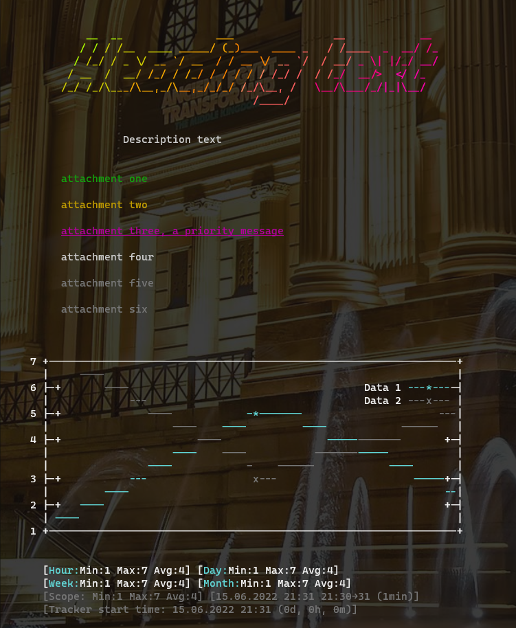

# Lolcatfigletgnuplotprint

A simple commandline output utility package for printing simple messages and linear xy-plot data with colours and style

## Requirements

Relies on [lolcat](https://github.com/tehmaze/lolcat), [figlet](http://www.figlet.org/) and [gnuplot](http://www.gnuplot.info/).

## Install

```
python -m pip install lolcatfigletgnuplotprint
```

## Usage

Library function:

```
from lolcatfigletgnuplotprint import print_example
print_example()
```

Commandline util:

```
python -m lolcatfigletgnuplotprint --help
```

Run with prebuilt docker image:

```
docker run -it --rm lsipii/lolcatfigletgnuplotprint --help
```

## Example output


